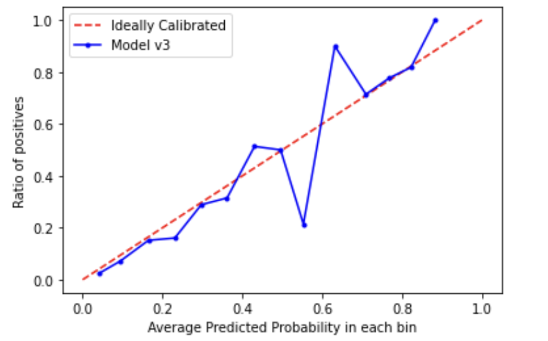
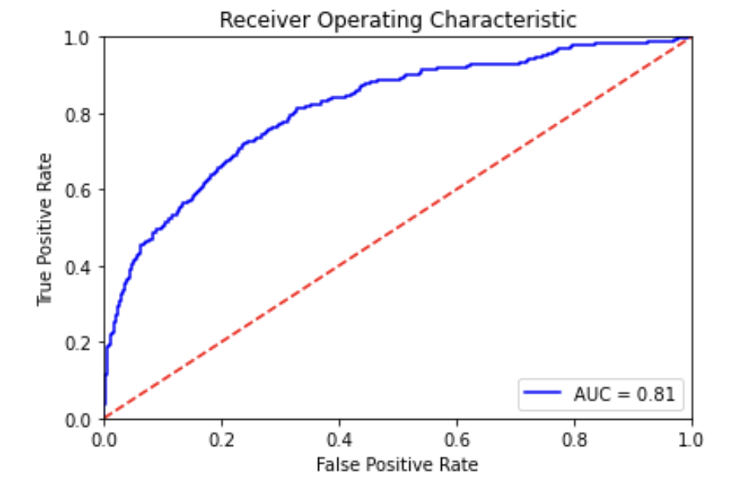

# Regression Project for XG

## Project Description 
This project focuses on predicting Expected Goals (xG) in football matches using a linear regression model.
By analyzing shot data from various matches, the model aims to estimate the likelihood of scoring based on different factors like shot location, match context, and player statistics. 
This analysis provides valuable insights for coaches, analysts, and fans regarding team performance and scoring efficiency.

## Visualization Content

The created visualizations include:

1. **Calibration Curve**:
   - This image is a calibration plot, which compares the predicted probabilities of a model to the actual outcomes.
   - Red Dashed Line (Ideally Calibrated): This line shows a perfect calibration where predicted probabilities match the actual outcomes (e.g., 80% probability means 80% of      those events are positive).
   - Blue Line (Model v3): This line represents the calibration curve of your model, showing how well the predictions align with actual results.
     
   

   2. **Receiver Operating Characteristic (ROC)**:
   - This image is a Receiver Operating Characteristic (ROC) curve, which is used to evaluate the performance of a binary classification model.
   - This value summarizes the overall performance of the model. An AUC of 0.81 indicates good discriminative ability, with 1.0 being perfect and 0.5 being no better than random guessing.
   
   
